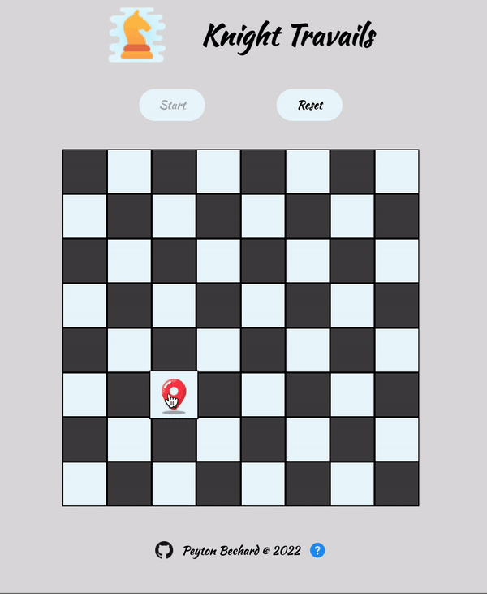

# Knight Travails

An interactive visual representation of the algorithm used to find the shortest path of a knight reaching any selected point on a chess board, which makes use of the graph data structure.

## <a href="https://www.pmbechard.github.io/knight-travails">Live Version</a>

